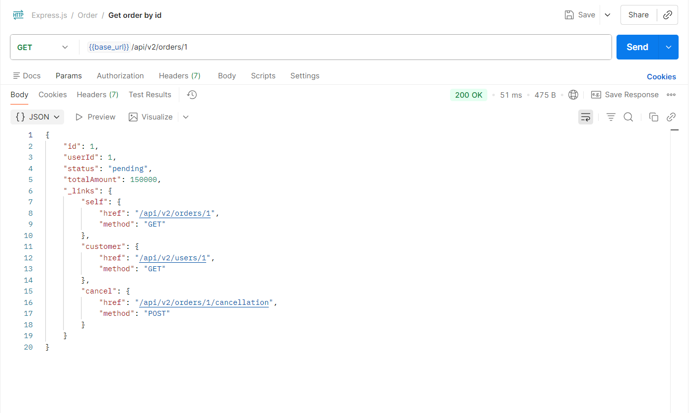
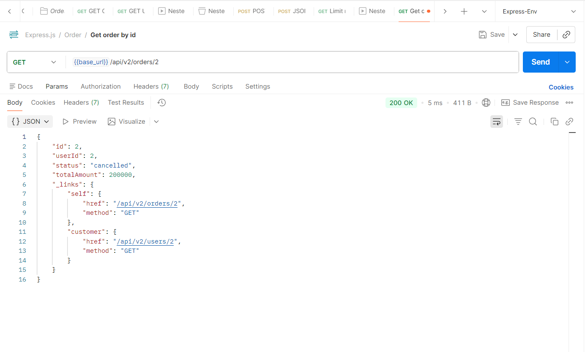

# HATEOAS API Implementation (ESM)

## Giải thích HATEOAS & Richardson Maturity Model

Khối `_links` giúp API nâng cấp từ **Level 2** lên **Level 3** trong mô hình Richardson Maturity Model (RMM):

- **Level 2 (HTTP Verbs):** API đã sử dụng đúng các URI và các phương thức HTTP (GET, POST, PUT, DELETE). Tuy nhiên, client vẫn phải tự "hardcode" các đường dẫn API cho hành động tiếp theo dựa trên tài liệu mô tả (API Documentation).
- **Level 3 (HATEOAS - Hypermedia As The Engine Of Application State):**
  - Response tự mô tả các hành động có thể thực hiện tiếp theo thông qua thuộc tính `_links`.
  - **Tự khám phá (Self-discoverable):** Client không cần hardcode URL điều hướng `/cancellation`, mà chỉ cần đọc trường `_links.cancel.href` trả về từ server.
  - **Điều hướng trạng thái động:** Khối `_links` thay đổi linh hoạt theo `status`. Khi đơn hàng chuyển sang `cancelled`, link `cancel` sẽ bị loại bỏ hoàn toàn, giúp chặn client gọi các hành động không hợp lệ từ phía giao diện.

---

## Kết quả Kiểm thử

### 1. Đơn hàng trạng thái `pending` (Có chứa link cancel)

### 2. Đơn hàng trạng thái `cancelled` (Đã ẩn link cancel)

